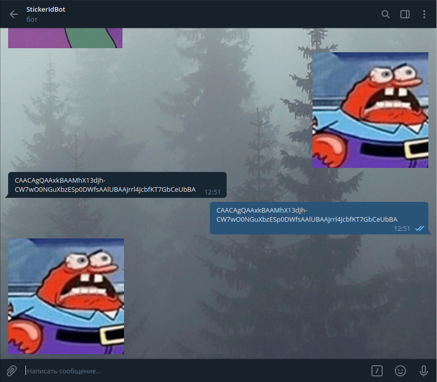

# StickerIdTelegramBot

Telegram bot that determines the ID of the sent sticker, as well as returns the sticker based on the sent ID

## Execution example:


## Instruction:
1. ```git clone https://github.com/NikitaKolotushkin/StickerIdTelegramBot.git```
2. ```pip3 install -r requirements.txt```
3. Goto ```main.py``` and enter your bot token to 7 line
4. **Done**
